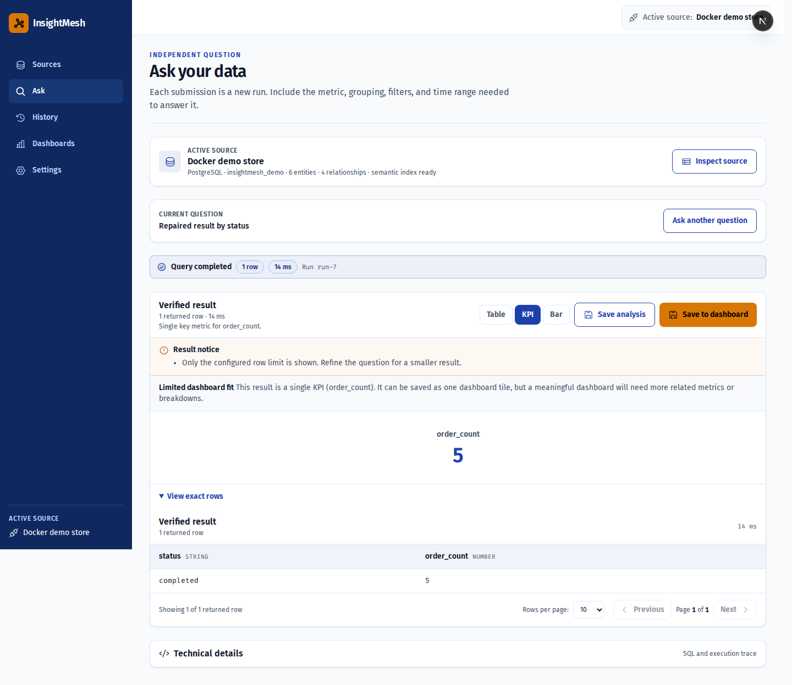
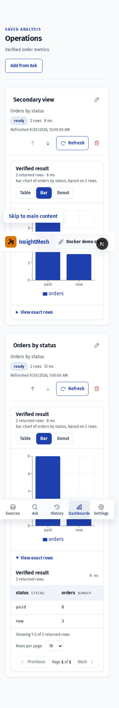
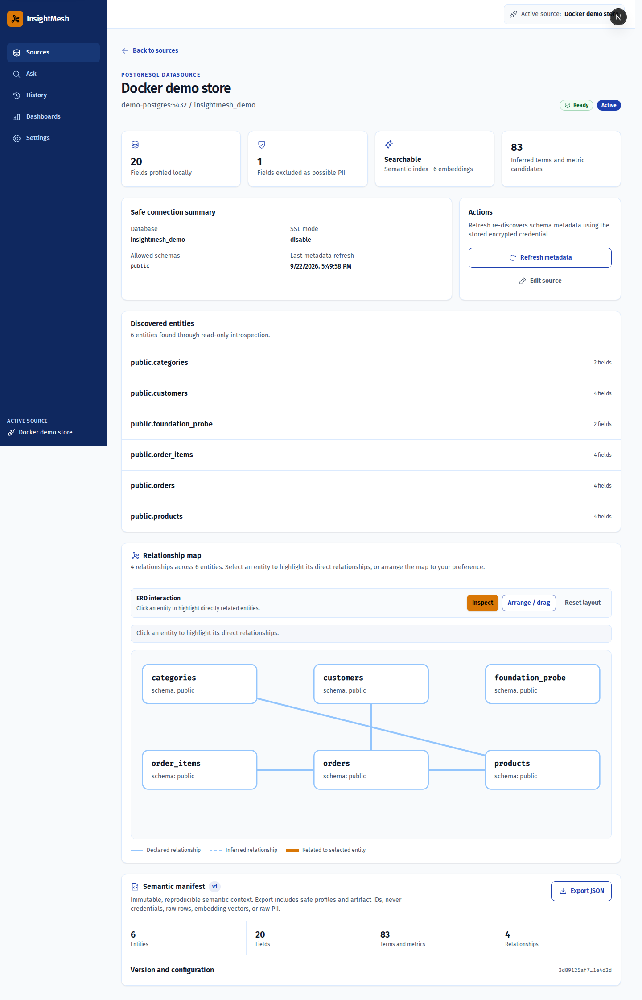

  

  <strong>English</strong> | <a href="README_VI.md">Tiếng Việt</a>

<h3 align="center">Ask Questions in Plain Language. Explore Your Data Safely.</h3>

  
  
  
  
  
  

---

## Table of Contents

1. [Project Overview](#project-overview)
2. [System Architecture & Data Flow](#system-architecture--data-flow)
3. [Core Features](#core-features)
4. [Tech Stack](#tech-stack)
5. [Directory Structure](#directory-structure)
6. [Quick Start Guide](#quick-start-guide)
7. [Service Endpoints](#service-endpoints)
8. [Evaluation & Quality Gates](#evaluation--quality-gates)
9. [Security & Privacy](#security--privacy)
10. [Known Limitations](#known-limitations)
11. [Troubleshooting](#troubleshooting)

---

## Project Overview

InsightMesh is a local-first natural-language analytics workspace for PostgreSQL and MySQL. Users connect a read-only datasource, inspect schema and relationships, ask questions in plain language, review generated SQL and execution traces, and save verified results as analyses or dashboard widgets.

MongoDB is intentionally out of scope for V1. Provider enrichment is optional: local introspection, profiling, semantic retrieval, SQL validation, and deterministic execution remain usable without an external AI provider.

### Problem → Solution → Result (PSR)

| Dimension | Description |
|---|---|
| **Problem** | Business questions use natural language while databases expose technical schemas. Analysts need a safe way to understand tables, generate SQL, verify results, and reuse analyses without exposing raw data to an LLM. |
| **Solution** | Build a privacy-bounded semantic layer from metadata and profiles, retrieve relevant schema context, generate dialect-aware SQL, validate it with SQLGlot, execute through read-only connectors, and present a verified result with traceable states. |
| **Result** | A reproducible Ask workflow across PostgreSQL and MySQL with datasource inspection, ERD interactions, suggestions, chart/table fallback, dashboards, saved analyses, query history, retention, and deterministic evaluation. |

### Measured release result

The latest 37-case hybrid evaluation (25 PostgreSQL and 12 MySQL cases, generated on 2026-09-21) measured:

| Metric | Result |
|---|---:|
| Status accuracy | 100% |
| Execution rate | 100% |
| Result accuracy | 100% |
| Mean entity recall | 100% |
| Mean entity precision | 66.98% |
| Join-path accuracy | 100% |
| Easy / medium / hard result accuracy | 100% / 100% / 100% |

The suite also includes 2 ambiguous, 3 out-of-scope, and 5 unsafe cases; all terminal statuses were classified correctly.

---

## System Architecture & Data Flow

The system boundary, provider privacy boundary, deterministic query path, and datasource separation are documented in [docs/ARCHITECTURE.md](docs/ARCHITECTURE.md).

~~~mermaid
flowchart LR
    U[User] --> F[Next.js Ask workspace]
    F --> A[FastAPI API]
    A --> M[(Metadata DB - PostgreSQL + pgvector)]
    A --> S[Semantic retrieval - metadata only]
    S --> L[Optional LLM / embedding provider]
    A --> V[SQLGlot validator - read-only policy]
    V --> C[Dialect connector]
    C --> PG[(PostgreSQL source)]
    C --> MY[(MySQL source)]
    A --> R[Verified result, trace, dashboard]
    R --> F
~~~

### Runtime flow

1. **Onboard** — validate credentials, discover schema metadata, profile safe field statistics, and build a privacy-bounded semantic index.
2. **Understand** — show entities, fields, safe sample rows, profiles, relationships, ERD layout, and three source-aware question suggestions.
3. **Ask** — classify the question, retrieve relevant metadata, generate dialect-specific SQL, validate safety, and execute through the selected connector.
4. **Verify** — verify result shape and values, select a table/chart/KPI view, and expose SQL plus a safe structured trace.
5. **Reuse** — save an analysis, save a dashboard widget, refresh results in place, or rerun as a new recent activity.

### Evidence

  
  

  

The browser demo is available at [docs/assets/recordings/insightmesh-ask-demo.webm](docs/assets/recordings/insightmesh-ask-demo.webm). Run repeatable browser coverage with the test profile command in the Quick Start section.

---

## Core Features

### 1. Read-only datasource onboarding

Connect PostgreSQL or MySQL with encrypted credentials, allowlist databases, verify connectivity, and refresh metadata without persisting raw rows or secrets in API responses.

### 2. Datasource inspection and ERD

Inspect entities, fields, safe sample rows, semantic profiles, and relationships. The ERD supports drag-and-drop, reset-to-default, and relationship highlighting when an entity is selected. Sources and Ask inspect mode share the same interaction model.

### 3. Source-aware question suggestions

The Ask workspace provides three inline suggestions derived from the active datasource context.

### 4. Dialect-aware natural-language queries

The runtime selects PostgreSQL or MySQL deterministically, generates bounded SQL, validates statements with SQLGlot, blocks unsafe operations, executes with read-only connectors, and supports bounded repair for eligible failures.

### 5. Verified results and visualizations

Results include truthful status transitions, paginated tables, SQL, safe traces, warnings, chart/KPI recommendations, and table fallback when visualization is unsuitable.

### 6. Reusable analyses and dashboards

Save validated analyses with query definition and result snapshot, refresh saved results in place, and save compatible results as dashboard widgets. Recent activity is execution history; saved analyses are durable reusable assets.

### 7. Retention-aware history

Recent query artifacts expire after 7 days by default and run summaries after 90 days. Saved analyses copy the validated query definition and survive recent-activity cleanup.

---

## Tech Stack

* **FastAPI + Python** — typed API, deterministic query state machine, SQLGlot validation, connectors, result verification, and evaluation.
* **PostgreSQL 16 + pgvector** — application metadata, semantic artifacts, embeddings, query runs, saved analyses, dashboards, and widgets.
* **Next.js + React + TypeScript + Tailwind CSS** — responsive Sources, Ask, History, and Dashboard workspaces.
* **PostgreSQL and MySQL 8** — supported source engines with read-only execution.
* **Gemini 2.5 Flash** — primary structured-generation provider; OpenRouter is a bounded fallback when configured.
* **Docker Compose + Alembic + uv + npm ci** — reproducible services, migrations, and locked dependencies.
* **Playwright + Vitest** — browser acceptance and component/unit coverage.

---

## Directory Structure

~~~text
insightmesh-multi-source-analytics/
├── compose.yaml                         # Local app and demo databases
├── .env.example                         # Development environment template
├── README.md / README_VI.md             # Bilingual documentation
├── backend/                             # FastAPI, connectors, query, semantic, services
├── frontend/                            # Next.js routes, components, tests, e2e
├── demo/postgres/                       # PostgreSQL demo store
├── demo/mysql/                          # MySQL demo store
├── docs/                                # Plan, PRD, design, architecture, evidence
├── design-system/insightmesh/           # Approved visual system
└── tests/                               # Backend and foundation test suites
~~~

---

## Quick Start Guide

### Prerequisites

* Docker Desktop with Linux containers, or Docker Engine with Compose v2+.
* Git, if cloning the repository.
* No host Python or Node.js installation is required.

### Step 1: Initialize the environment

~~~powershell
cd D:\project\insightmesh-multi-source-analytics
Copy-Item .env.example .env
docker compose config --quiet
~~~

Local defaults work without editing the environment file. Use development-only values and never commit real secrets. Database initialization credentials apply when volumes are first created; changing the environment file does not rotate existing passwords.

### Step 2: Launch the stack

~~~powershell
docker compose up --build -d --wait --wait-timeout 240
docker compose ps
~~~

Four long-running services should become healthy; the migration service exiting with code 0 is expected. To include MySQL:

~~~powershell
docker compose --profile mysql up --build -d --wait --wait-timeout 240
~~~

### Step 3: Connect and ask

Open Sources, choose PostgreSQL or MySQL, enter a read-only account, set host/port/database, and run **Test connection**. For Compose databases use service hosts demo-postgres or demo-mysql; localhost is for a host-published database, not a sibling container.

Activate a datasource, inspect its schema or choose a suggestion, ask a complete question, and review the verified result. **Refresh** updates a saved analysis in place; **Run again** intentionally creates a new recent execution.

### Step 4: Run quality gates

~~~powershell
docker compose exec backend python tests/foundation_smoke.py
docker compose run --rm backend uv run pytest
docker compose run --rm backend uv run ruff check .
docker compose run --rm backend uv run mypy .
docker compose run --rm --no-deps frontend npm run lint
docker compose run --rm --no-deps frontend npm run typecheck
docker compose run --rm --no-deps frontend npm run test
docker compose run --rm --no-deps frontend npm run build
docker compose --profile test run --rm e2e
~~~

---

## Service Endpoints

| Service | URL | Purpose |
|---|---|---|
| **Frontend** | [http://localhost:3000](http://localhost:3000) | Sources, Ask, History, and Dashboards |
| **Backend health** | [http://localhost:8000/api/v1/health](http://localhost:8000/api/v1/health) | API liveness/readiness |
| **API docs** | [http://localhost:8000/docs](http://localhost:8000/docs) | OpenAPI documentation |
| **Frontend-to-backend health** | [http://localhost:3000/api/health](http://localhost:3000/api/health) | Browser connectivity check |

Metadata and demo databases are internal Compose services and do not bind host ports by default.

### Demo datasource credentials

| Source | Host inside Compose | Port | Database | User | Password |
|---|---|---:|---|---|---|
| PostgreSQL demo | demo-postgres | 5432 | insightmesh_demo | demo_reader | DEMO_READER_PASSWORD |
| MySQL demo | demo-mysql | 3306 | insightmesh_demo | demo_reader | DEMO_READER_PASSWORD |

Both demo accounts are restricted to SELECT. For a host-installed database, use the address reachable from the backend and the actual database account.

---

## Evaluation & Quality Gates

~~~powershell
docker compose --profile mysql up -d demo-mysql
docker compose exec backend python -m evals.run_combined_evaluation --strategy hybrid
~~~

The command writes per-datasource and per-difficulty reports plus the combined-latest.json report. The release suite covers easy, medium, hard, ambiguous, out-of-scope, and unsafe questions.

---

## Security & Privacy

* Datasource passwords are encrypted at rest and never returned by the API.
* Connectors enforce read-only execution; SQLGlot blocks write and multi-statement operations.
* Provider context is limited to metadata, profiles, and relevant schema context. Raw rows, credentials, prompts, embeddings, and hidden reasoning are excluded.
* Query traces are structured and inspectable without exposing sensitive internals.
* Recent query artifacts are retention-managed; saved analyses retain validated definitions and result snapshots.
* Compose defaults are for development. Use separate runtime/migration roles, managed secrets, pinned image digests, and TLS before production.

---

## Known Limitations

* MongoDB is intentionally out of scope for V1.
* Query-run creation is synchronous; the UI shows a truthful waiting state.
* Dashboard arrangement currently uses keyboard-accessible move controls.
* Retrieval-context caching is deferred until repeat-hit and cost-saving evidence exists.
* Base-image tags are not pinned by digest yet.
* Provider-backed enrichment requires API keys; local introspection and deterministic tests remain usable without them.

---

## Troubleshooting

* **Connection fails from the browser** — localhost refers to the backend container during a connector call. Use demo-mysql, demo-postgres, host.docker.internal for Docker Desktop host services, or a reachable LAN address.
* **No entities are discovered** — check the allowlisted database, information_schema permissions, and selected schema tables, then use **Refresh metadata**.
* **Connection succeeds but the result is out of scope** — ask about fields in the active datasource and try a generated suggestion.
* **Chart becomes a table** — the result may lack a categorical dimension and numeric measure; the table is the truthful fallback.
* **MySQL demo is unavailable** — run the MySQL profile and confirm service health.
* **Migrations are stale** — run the migration service and inspect its logs.

Implementation references: [docs/IMPLEMENTATION_PLAN.md](docs/IMPLEMENTATION_PLAN.md), [docs/ARCHITECTURE.md](docs/ARCHITECTURE.md), [docs/InsightMesh_PRD.md](docs/InsightMesh_PRD.md), [docs/TECHNICAL_DESIGN.md](docs/TECHNICAL_DESIGN.md), and [design-system/insightmesh/MASTER.md](design-system/insightmesh/MASTER.md).

  

