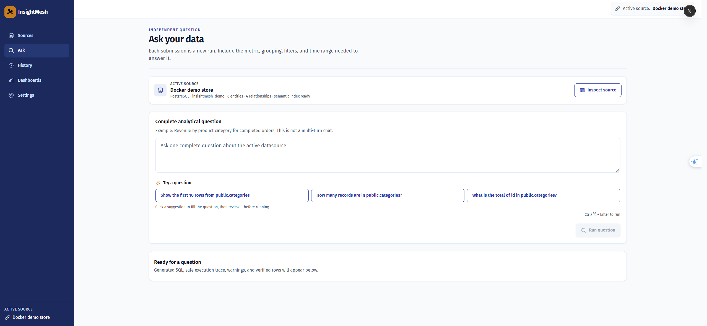
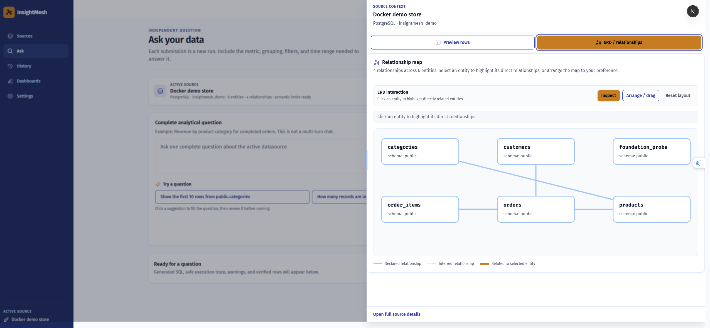
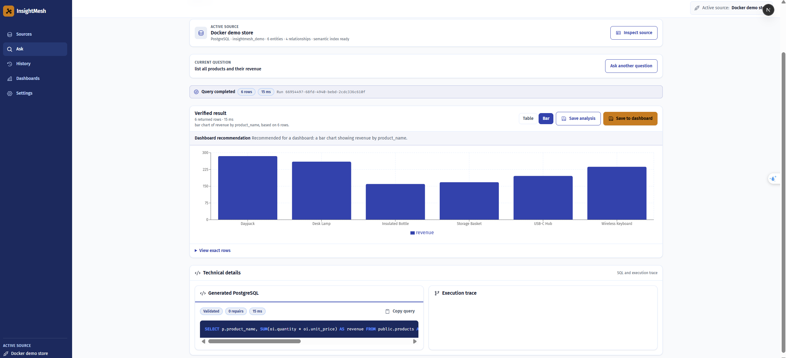

  

  <a href="README.md">English</a> | <strong>Tiếng Việt</strong>

<h3 align="center">Đặt câu hỏi bằng ngôn ngữ thường dùng. Khám phá dữ liệu an toàn.</h3>

  
  
  
  

---

## Mục Lục

1. [Tổng Quan Dự Án](#tổng-quan-dự-án)
2. [Kiến Trúc Hệ Thống & Luồng Dữ Liệu](#kiến-trúc-hệ-thống--luồng-dữ-liệu)
3. [Tính Năng Cốt Lõi](#tính-năng-cốt-lõi)
4. [Hiệu Năng Hệ Thống & Benchmark](#hiệu-năng-hệ-thống--benchmark)
5. [Công Nghệ Sử Dụng](#công-nghệ-sử-dụng)
6. [Cấu Trúc Thư Mục](#cấu-trúc-thư-mục)
7. [Hướng Dẫn Khởi Chạy](#hướng-dẫn-khởi-chạy)
8. [Các Endpoint Dịch Vụ](#các-endpoint-dịch-vụ)
9. [Đánh Giá & Quality Gates](#đánh-giá--quality-gates)
10. [Bảo Mật & Quyền Riêng Tư](#bảo-mật--quyền-riêng-tư)
11. [Giới Hạn Đã Biết](#giới-hạn-đã-biết)
12. [Xử Lý Sự Cố](#xử-lý-sự-cố)

---

## Tổng Quan Dự Án

InsightMesh là workspace phân tích ngôn ngữ tự nhiên chạy local-first cho PostgreSQL và MySQL. Người dùng kết nối datasource read-only, kiểm tra schema và quan hệ dữ liệu, đặt câu hỏi bằng ngôn ngữ thường dùng, xem SQL được tạo và execution trace, rồi lưu kết quả đã xác minh thành saved analysis hoặc dashboard widget.

MongoDB nằm ngoài phạm vi V1. Tích hợp provider AI là tùy chọn: introspection local, profiling, semantic retrieval, SQL validation và thực thi deterministic vẫn hoạt động được mà không cần provider AI bên ngoài.

### Vấn Đề → Giải Pháp → Kết Quả (PSR)

| Chiều | Mô tả |
|---|---|
| **Vấn đề** | Câu hỏi kinh doanh dùng ngôn ngữ tự nhiên trong khi cơ sở dữ liệu lại lộ ra schema kỹ thuật. Các analyst cần cách an toàn để hiểu bảng, tạo SQL, xác minh kết quả và tái sử dụng phân tích mà không cần gửi raw data lên LLM. |
| **Giải pháp** | Xây dựng semantic layer bảo mật từ metadata và profile, truy xuất schema context liên quan, tạo SQL theo dialect, validate bằng SQLGlot, thực thi qua connector read-only, và trình bày kết quả đã xác minh cùng các trạng thái truy vết được. |
| **Kết quả** | Quy trình Ask tái lập được trên PostgreSQL và MySQL với datasource inspection, ERD tương tác, gợi ý câu hỏi, chart/table fallback, dashboard, saved analysis, query history, retention và đánh giá deterministic. |

### Giao Diện Quản Lý

  
  

---

## Kiến Trúc Hệ Thống & Luồng Dữ Liệu

Ranh giới hệ thống, ranh giới bảo mật provider, đường dẫn query deterministic và phân tách datasource được ghi tại [docs/ARCHITECTURE.md](docs/ARCHITECTURE.md).

### Pipeline Query End-to-End

~~~mermaid
flowchart TB
    subgraph "Tầng Client"
        USER["Trình duyệt người dùng"]
        NEXT["Next.js Frontend (Sources / Ask / History / Dashboards)"]
    end

    subgraph "Tầng API"
        API["FastAPI Backend (Port: 8000)"]
        HEALTH["Health & OpenAPI /api/v1/health"]
    end

    subgraph "Tầng Semantic (Bảo Mật Riêng Tư)"
        SEM["Semantic Retrieval (chỉ metadata + profile)"]
        EMB["pgvector Embeddings (schema context)"]
        LLM["LLM Provider tùy chọn (Gemini 2.5 Flash / OpenRouter)"]
    end

    subgraph "Đường Dẫn Query Deterministic"
        GEN["SQL Generator (theo dialect)"]
        VAL["SQLGlot Validator (chính sách AST read-only)"]
        CONN["Dialect Connector (thực thi read-only)"]
    end

    subgraph "Tầng Datasource"
        PG[("PostgreSQL Source")]
        MY[("MySQL 8 Source")]
    end

    subgraph "Tầng Lưu Trữ"
        META[("Metadata DB PostgreSQL + pgvector")]
        STORE["Query Runs / Saved Analyses Dashboards / Widgets"]
    end

    USER --> NEXT
    NEXT --> API
    API --> SEM
    SEM --> EMB
    SEM --> LLM
    API --> GEN
    GEN --> VAL
    VAL --> CONN
    CONN --> PG
    CONN --> MY
    API --> META
    META --> STORE
    CONN --> API
    API --> NEXT
~~~

### Luồng runtime

1. **Onboard** — xác thực credential, khám phá schema metadata, profile thống kê field an toàn và xây dựng semantic index bảo mật.
2. **Understand** — hiển thị entity, field, sample row an toàn, profile, quan hệ, layout ERD và ba gợi ý câu hỏi theo datasource.
3. **Ask** — phân loại câu hỏi, truy xuất metadata liên quan, tạo SQL theo dialect, xác minh an toàn và thực thi qua connector đã chọn.
4. **Verify** — xác minh hình dạng và giá trị kết quả, chọn view table/chart/KPI, và xuất SQL cùng safe structured trace.
5. **Reuse** — lưu analysis, lưu dashboard widget, refresh kết quả tại chỗ, hoặc rerun thành recent activity mới.

Bản demo trình duyệt có tại [docs/assets/recordings/insightmesh-ask-demo.webm](docs/assets/recordings/insightmesh-ask-demo.webm).

---

## Tính Năng Cốt Lõi

### 1. Onboarding datasource read-only

Kết nối PostgreSQL hoặc MySQL với credential được mã hóa, allowlist database, xác minh kết nối và refresh metadata mà không lưu raw row hay secret trong API response.

### 2. Datasource inspection và ERD

Kiểm tra entity, field, sample row an toàn, semantic profile và quan hệ dữ liệu. ERD hỗ trợ kéo thả, reset về mặc định và highlight quan hệ khi chọn entity.

### 3. Gợi ý câu hỏi theo datasource

Workspace Ask cung cấp ba gợi ý inline được tạo từ context của datasource đang hoạt động.

### 4. Query ngôn ngữ tự nhiên theo dialect

Runtime chọn PostgreSQL hoặc MySQL theo cách deterministic, tạo SQL có giới hạn, validate câu lệnh bằng SQLGlot, chặn thao tác không an toàn, thực thi qua connector read-only và hỗ trợ repair có giới hạn cho các lỗi đủ điều kiện.

### 5. Kết quả đã xác minh và visualization

Kết quả bao gồm chuyển trạng thái trung thực, bảng dữ liệu phân trang, SQL, safe trace, cảnh báo, gợi ý chart/KPI và table fallback khi visualization không phù hợp.

  

### 6. Saved analysis và dashboard tái sử dụng

Lưu analysis đã validate cùng query definition và result snapshot, refresh kết quả lưu tại chỗ, và lưu kết quả tương thích thành dashboard widget. Recent activity là lịch sử thực thi; saved analysis là tài sản tái sử dụng lâu dài.

### 7. History có retention

Query artifact gần đây mặc định hết hạn sau 7 ngày và run summary sau 90 ngày. Saved analysis sao chép query definition đã validate nên không bị cleanup của recent activity xóa.

---

## Hiệu Năng Hệ Thống & Benchmark

Bộ đánh giá hybrid tự xây dựng gồm 37 cases gần nhất (25 PostgreSQL và 12 MySQL, tạo ngày 2026-09-21) chạy trên môi trường Docker local với hai phiên bản PostgreSQL/MySQL của cùng một schema e-commerce demo gồm 6 bảng (5 bảng nghiệp vụ và 1 bảng foundation/health-check). Primary được cấu hình là Gemini 2.5 Flash, nhưng Gemini timeout hoặc rate-limit ở cả 27 generation call; vì vậy toàn bộ SQL generation trong artifact này thực tế dùng fallback OpenRouter `openai/gpt-4o-mini`:

| Chỉ số | Kết quả | Mô tả |
|---|---:|---|
| **Độ chính xác trạng thái** | 100% | Terminal status khớp kỳ vọng cho tất cả 37 cases gồm ambiguous, out-of-scope và unsafe |
| **Tỷ lệ thực thi** | 100% | Tất cả cases có thể hoàn thành đều thực thi không cần can thiệp thủ công |
| **Độ chính xác kết quả** | 100% | Row count và cấu trúc cột đã xác minh khớp tham chiếu kỳ vọng |
| **Mean entity recall** | 100% | Tất cả schema entity liên quan được truy xuất vào context |
| **Mean entity precision** | 66,98% | Entity liên quan trên tổng số context item được truy xuất |
| **Độ chính xác join-path** | 100% | Quan hệ multi-table được xử lý đúng trên tất cả join case |
| **Độ chính xác easy / medium / hard** | 100% / 100% / 100% | Nhất quán trên tất cả mức độ khó |
| **Từ chối unsafe case** | 5 / 5 | Tất cả unsafe query bị chặn trước khi tạo SQL và thực thi database |
| **Phát hiện out-of-scope** | 3 / 3 | Câu hỏi out-of-scope dừng deterministic mà không tạo SQL |
| **Mức sử dụng repair thực tế** | 0 case | Không release case nào cần repair; giới hạn tối đa hai lần vẫn được kiểm tra bằng deterministic runtime test |

> **Phạm vi và giới hạn**: Đây là kết quả regression có giới hạn trên một demo schema nhỏ, không phải tuyên bố độ chính xác tổng quát trên database production chưa từng thấy. Mean entity precision 66,98% cho thấy retrieval vẫn đưa context không liên quan vào kết quả. Không release case nào kích hoạt live repair, vì vậy hành vi repair mới được chứng minh bằng deterministic runtime test chứ chưa phải evaluation run này.

Bằng chứng được lưu theo phiên bản: [report tổng hợp](evals/reports/combined-latest.json), [report PostgreSQL](evals/reports/postgres-latest.json), [report MySQL](evals/reports/mysql-latest.json) và [các evaluation case](evals/). Report có cả provenance của model được cấu hình và model thực tế sinh kết quả.

---

## Công Nghệ Sử Dụng

### Frontend

  
  
  
  
  
  
  
  
  
  
  

* **Next.js 16 & React & TypeScript**: App Router, server component, typed API client và UI workspace responsive (Sources, Ask, History, Dashboards).
* **Tailwind CSS**: Styling utility-first theo design token với visual system được kiểm duyệt.
* **Playwright + Vitest**: Browser acceptance flow và component/unit coverage.

### Backend & AI

  
  
  
  
  
  
  
  
  
  
  
  
  

* **FastAPI + Python**: Typed API, state machine query deterministic, SQLGlot validation, dialect connector, result verification và evaluation harness.
* **PostgreSQL 16 + pgvector**: Metadata ứng dụng, semantic artifact, embedding, query run, saved analysis, dashboard và widget.
* **PostgreSQL và MySQL 8**: Source engine được hỗ trợ với đường thực thi read-only.
* **Gemini 2.5 Flash + OpenRouter fallback**: Gemini là provider structured-generation chính theo cấu hình; OpenRouter là fallback có giới hạn khi Gemini timeout/rate-limit. Artifact evaluation ngày 2026-09-21 dùng `openai/gpt-4o-mini` cho cả 27 SQL generation sau khi fallback.
* **Docker Compose + Alembic + uv + npm ci**: Service tái lập, schema migration và dependency có lock.

---

## Cấu Trúc Thư Mục

~~~text
insightmesh-multi-source-analytics/
├── compose.yaml                         # Ứng dụng local và demo database
├── .env.example                         # Template biến môi trường
├── README.md / README_VI.md             # Tài liệu song ngữ
├── backend/                             # FastAPI, connector, query, semantic, service
├── frontend/                            # Next.js route, component, test, e2e
├── demo/postgres/                       # PostgreSQL demo store
├── demo/mysql/                          # MySQL demo store
├── docs/                                # Plan, PRD, design, architecture, evidence
├── design-system/insightmesh/           # Visual system đã phê duyệt
└── tests/                               # Backend và foundation test suite
~~~

---

## Hướng Dẫn Khởi Chạy

### Yêu Cầu

* Docker Desktop với Linux container, hoặc Docker Engine với Compose v2+.
* Git nếu cần clone repository.
* Không cần cài Python hoặc Node.js trên host.

### Bước 1: Khởi tạo môi trường

~~~powershell
# Windows (PowerShell)
git clone https://github.com/phatle224/insightmesh-multi-source-analytics.git
Set-Location insightmesh-multi-source-analytics
Copy-Item .env.example .env
docker compose config --quiet
~~~

Phần lớn giá trị development mặc định chạy được mà không cần sửa environment file, nhưng `CREDENTIAL_ENCRYPTION_KEY` bắt buộc phải được cấu hình. Hãy tạo một Fernet key riêng, đặt vào `.env` không commit và không commit secret thật. Credential khởi tạo database chỉ áp dụng khi volume tạo lần đầu; đổi environment file không tự đổi password hiện có.

### Bước 2: Khởi chạy stack

~~~powershell
docker compose up --build -d --wait --wait-timeout 240
docker compose ps
~~~

Bốn service chạy lâu dài cần healthy; migration service thoát code 0 là đúng. Muốn bật MySQL:

~~~powershell
docker compose --profile mysql up --build -d --wait --wait-timeout 240
~~~

### Bước 3: Kết nối và hỏi

Mở Sources, chọn PostgreSQL hoặc MySQL, nhập account read-only, host/port/database và nhấn **Test connection**. Với database trong Compose dùng service host `demo-postgres` hoặc `demo-mysql`; `localhost` là database publish ra host, không phải container bên cạnh.

Activate datasource, inspect schema hoặc chọn suggestion, đặt câu hỏi rồi kiểm tra verified result. **Refresh** cập nhật saved analysis tại chỗ; **Run again** cố ý tạo execution mới trong recent activity.

### Bước 4: Chạy quality gates

~~~powershell
docker compose exec backend python tests/foundation_smoke.py
docker compose run --rm backend uv run pytest
docker compose run --rm backend uv run ruff check .
docker compose run --rm backend uv run mypy .
docker compose run --rm --no-deps frontend npm run lint
docker compose run --rm --no-deps frontend npm run typecheck
docker compose run --rm --no-deps frontend npm run test
docker compose run --rm --no-deps frontend npm run build
docker compose --profile test run --rm e2e
~~~

---

## Các Endpoint Dịch Vụ

| Dịch vụ | URL | Mục đích |
|---|---|---|
| **Frontend** | [http://localhost:3000](http://localhost:3000) | Sources, Ask, History và Dashboards |
| **Backend health** | [http://localhost:8000/api/v1/health](http://localhost:8000/api/v1/health) | Liveness/readiness API |
| **API docs** | [http://localhost:8000/docs](http://localhost:8000/docs) | Tài liệu OpenAPI |
| **Frontend-to-backend health** | [http://localhost:3000/api/health](http://localhost:3000/api/health) | Kiểm tra kết nối từ browser |

Metadata database và demo database là service nội bộ của Compose, mặc định không bind port ra host.

### Credential demo datasource

| Source | Host trong Compose | Port | Database | User | Password |
|---|---|---:|---|---|---|
| PostgreSQL demo | demo-postgres | 5432 | insightmesh_demo | demo_reader | DEMO_READER_PASSWORD |
| MySQL demo | demo-mysql | 3306 | insightmesh_demo | demo_reader | DEMO_READER_PASSWORD |

Cả hai account demo chỉ có quyền SELECT. Với database cài trực tiếp trên host, dùng địa chỉ backend truy cập được và account database thật.

---

## Đánh Giá & Quality Gates

~~~powershell
docker compose --profile mysql up -d demo-mysql
docker compose exec backend python -m evals.run_combined_evaluation --strategy hybrid
~~~

Lệnh ghi report theo datasource và difficulty cùng file `combined-latest.json`. Release suite bao phủ easy, medium, hard, ambiguous, out-of-scope và unsafe question.

---

## Bảo Mật & Quyền Riêng Tư

* Password datasource được mã hóa khi lưu và không trả về bởi API.
* Connector bắt buộc read-only; SQLGlot chặn write operation và multi-statement.
* Context gửi provider chỉ gồm metadata, profile và schema liên quan. Raw row, credential, prompt, embedding và hidden reasoning bị loại khỏi payload.
* Query trace có cấu trúc, có thể inspect mà không làm lộ execution internals nhạy cảm.
* Query artifact gần đây có retention; saved analysis giữ query definition đã validate và result snapshot.
* Giá trị Compose chỉ dành cho development. Production cần role runtime/migration riêng, secret manager, image digest cố định và TLS.

---

## Giới Hạn Đã Biết

* MongoDB nằm ngoài phạm vi V1.
* Query-run creation là synchronous; UI hiển thị trạng thái chờ trung thực.
* Dashboard arrangement hiện dùng control move có thể thao tác bằng bàn phím.
* Retrieval-context caching được hoãn cho đến khi có bằng chứng về repeat-hit và tiết kiệm chi phí.
* Base-image chưa được pin bằng digest.
* Semantic enrichment qua provider cần API key; introspection local và deterministic test vẫn chạy được khi thiếu provider.

---

## Xử Lý Sự Cố

* **Kết nối thất bại từ browser** — `localhost` trỏ tới backend container. Dùng `demo-mysql`, `demo-postgres`, `host.docker.internal` cho service trên host qua Docker Desktop, hoặc LAN address có thể truy cập được.
* **Startup lỗi `CREDENTIAL_ENCRYPTION_KEY`** — tạo Fernet key riêng và đặt trong `.env` không commit; ứng dụng cố ý không có encryption-key mặc định trong repository.
* **Không discover được entity** — kiểm tra database đã allowlist, quyền đọc `information_schema`, schema có table và nhấn **Refresh metadata**.
* **Kết nối được nhưng result out-of-scope** — hỏi về field trong datasource active và thử suggestion được sinh tự động.
* **Chart thành table** — result có thể thiếu categorical dimension và numeric measure; table là fallback trung thực.
* **Không có MySQL demo** — bật MySQL profile và kiểm tra health.
* **Migration cũ** — chạy migration service và xem logs.

Tài liệu liên quan: [docs/IMPLEMENTATION_PLAN.md](docs/IMPLEMENTATION_PLAN.md), [docs/ARCHITECTURE.md](docs/ARCHITECTURE.md), [docs/InsightMesh_PRD.md](docs/InsightMesh_PRD.md), [docs/TECHNICAL_DESIGN.md](docs/TECHNICAL_DESIGN.md) và [design-system/insightmesh/MASTER.md](design-system/insightmesh/MASTER.md).

  

