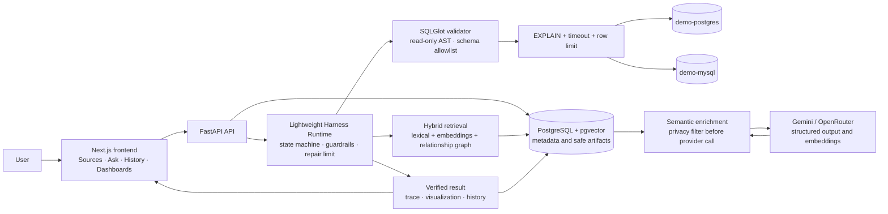

# InsightMesh architecture

InsightMesh keeps the user-facing application, metadata store, analytical datasources, and provider boundary separate. The backend owns the safety policy and never sends credentials, raw rows, raw PII, or hidden reasoning to a provider.



## Runtime boundaries

- `metadata-db` stores normalized datasource metadata, profiles, semantic artifacts, embeddings, query runs, saved analyses, dashboards, and safe traces.
- `demo-postgres` and `demo-mysql` are separate analytical databases. Their reader accounts are restricted to `SELECT` and the application also enforces read-only transactions.
- Retrieval is datasource-scoped. Exact identifiers and business terms are fused with vector similarity before relationship expansion.
- Generated or stored SQL passes deterministic AST validation, allowed-schema checks, `EXPLAIN`, statement timeout, and row limits before execution.
- Result verification normalizes types, nulls, warnings, truncation, and visualization compatibility before the result is exposed to the UI.
- Provider requests contain only privacy-filtered metadata/context. Credentials are encrypted at rest and are resolved only inside the connector boundary.

## Reproducible entry points

```powershell
docker compose up --build -d --wait --wait-timeout 240
docker compose --profile mysql up -d demo-mysql
docker compose --profile test run --rm e2e
docker compose exec backend python -m evals.run_combined_evaluation --strategy hybrid
```

See the [implementation tracker](IMPLEMENTATION_PLAN.md) for phase status and evidence, and the [technical design](TECHNICAL_DESIGN.md) for API/data contracts.
